#### 一. 1.4.4.py中代码29行出现问题,对应书籍29页
原因: i 没有使用str强转类型
<br>
修改如下:
```python
for url in ["ImageUrl_"+str(i) for i in range(10)]:
```
感谢 [@jsqlzy](@jsqlzy)

#### 2. 书籍182页出现问题
原因: 笔误
<br>

<br>
将sqlite3改成MySQLdb

感谢 [@lg-Cat73](@lg-Cat73)

#### 3. 书籍P122-P123 CSS选择器表达式多出空格
原因:印刷错误
<br>

<br>

<br>
感谢 [@Judy0513](@Judy0513)

#### 4. 书籍P144和P156 soup.find_all('a', href = re.compile(r'/view/\d+.htm'))正则表达式有误
原因：百度词条的链接链接结构发生改变，不属于程序错误。
修改如下：
```python
links = soup.find_all('a', href=re.compile(r'/item/.*'))
```
感谢 [@Judy0513](@Judy0513)
#### 5.书籍P138页代码有误,多出空格
原因:笔误
<br>

<br>
修改如下：
```python
smtp_server = 'smtp.163.com'
```
感谢 [@shaodamao](@shaodamao)

#### 6.P58 --表2-4 实现效果第6行，应该是"这些元素拥有值为en的lang属性"
原因:笔误
<br>

<br>
感谢 [@Judy0513](@Judy0513)

#### 7.P305 def parse_item(self, response), def parse_body(self, response)两个函数排版
原因:排版问题
<br>
感谢 [@Judy0513 ](@Judy0513 ) 

#### 8.P29，上面那块代码后的文字，任务进程已经编写完成（应该为服务进程）
原因：笔误
<br>
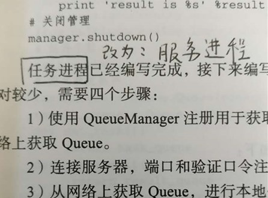
<br>
感谢 [@wushicanASL](@wushicanASL) 

#### 9.P113,倒数第5行 Tag 的content属性 应为Tag的contents属性
原因：笔误
<br>
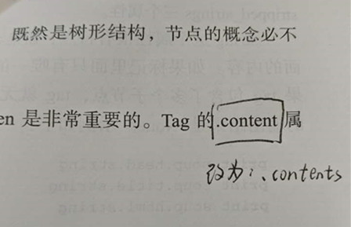
<br>
感谢 [@wushicanASL](@wushicanASL) 

#### 10. P137 5.3节Email提醒 开始 第三行，发送邮件的协议是STMP（应该为SMTP）
原因：笔误
<br>

<br>
感谢 [@wushicanASL](@wushicanASL) 

#### 11.P145和P152 存储成html,火狐打开出现乱码(其实可以使用火狐可以选择不同的编码)
解决添加如下代码:
<br>
```python
fout.write("<head><meta charset='utf-8'/></head>")
```
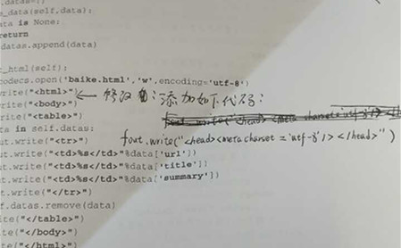
<br>
感谢 [@jsqlzy](@jsqlzy) 


#### 12.P21 代码有误
修改为：
```python
p2.terminate()
```
<br>


<br>
感谢 [@Judy0513 ](@Judy0513 ) 

#### 13.P107 逗号
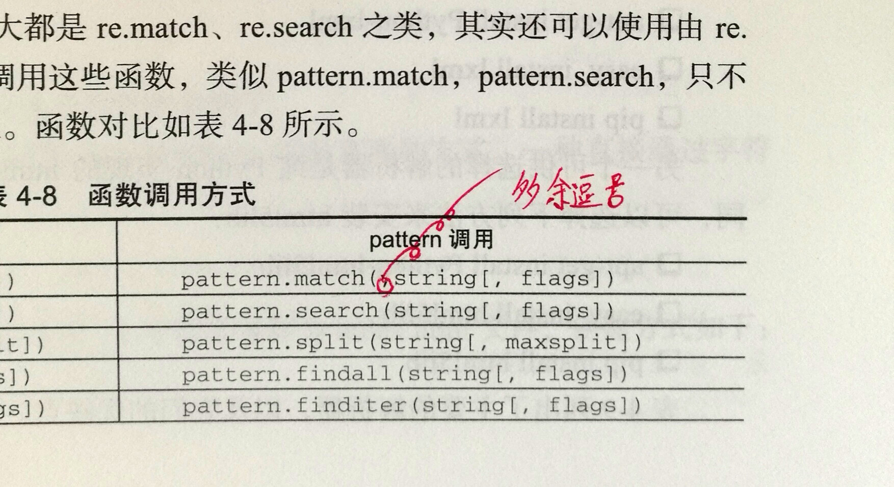
<br>
感谢 [@yaleimeng](@yaleimeng) 
#### 14.P10语句不通顺

<br>
感谢 [@yaleimeng](@yaleimeng)
#### 15.P228多余缩进
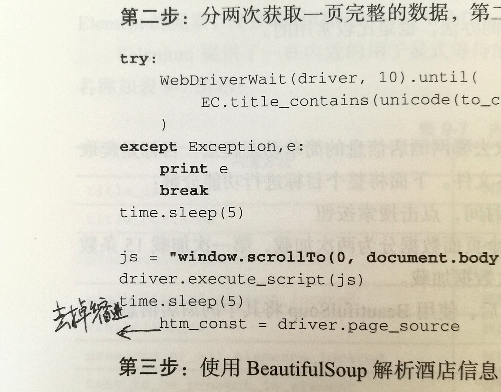
<br>
感谢 [@yaleimeng](@yaleimeng)
#### 16.P270缺少HTML头部
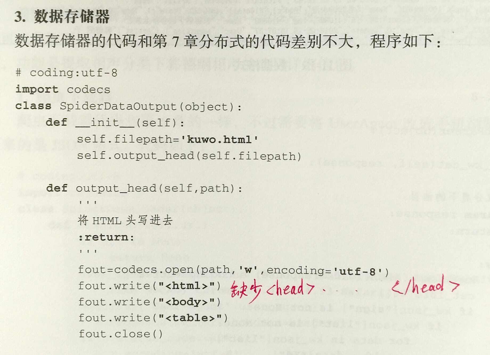
<br>
感谢 [@yaleimeng](@yaleimeng)
#### 17.P281代码与配图错误
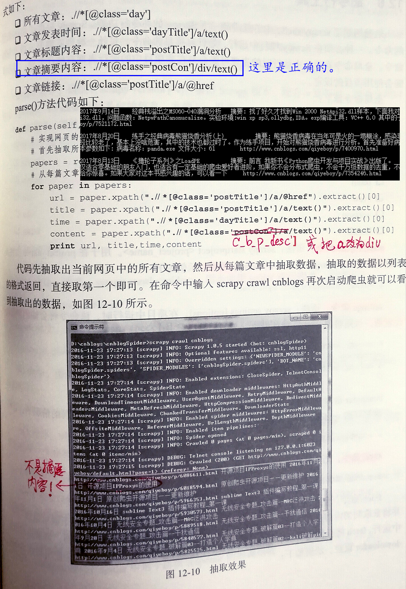
<br>
感谢 [@yaleimeng](@yaleimeng)[@doujanbo](@doujanbo )
#### 18.P397笔误
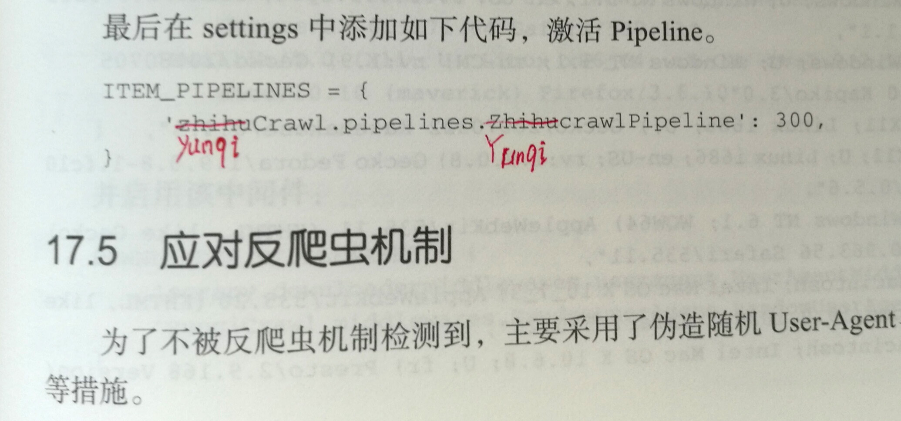
<br>
感谢 [@yaleimeng](@yaleimeng)
#### 19.P43多余空格
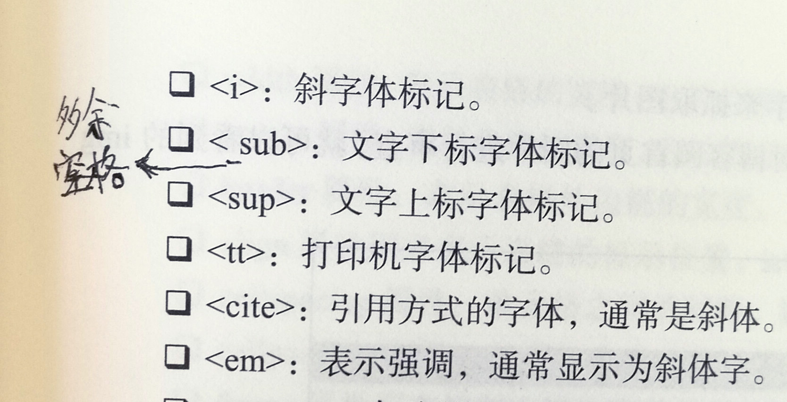
<br>
感谢 [@yaleimeng](@yaleimeng)
#### 20.代码ch05/5.1.1.py
python3.x 无法 保存json文件问题
<br>
with open('qiye.json','wb') as fp:改为
<br>
with open('qiye.json','w') as fp:
#### 21.第七章：简单分布式爬虫提问
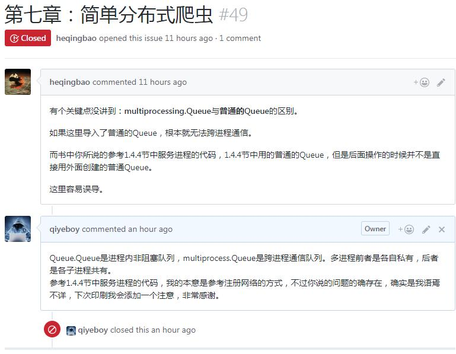
<br>
感谢 [@heqingbao](@heqingbao)
#### 22.第七章：代码中数据存储条件问题
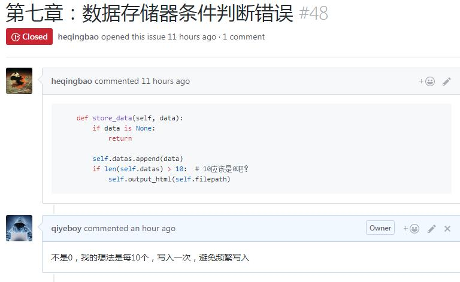
<br>
感谢 [@heqingbao](@heqingbao)
#### 23.111 页书写错误
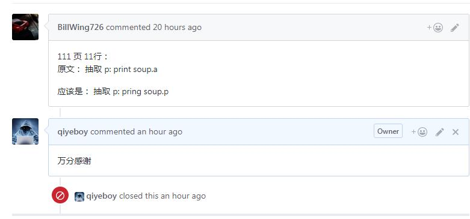
<br>
感谢 [@BillWing726](@BillWing726)
#### 24.第六章 DataOutput
去掉 self.datas.remove(data)
#### 25.第七章 ControlNode DataOutput
self.datas.remove(data)改为
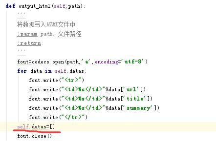
#### 26.14页获取路径名的拼写错误
14页获取路径名的文件名拼写错误：
<br>
原文错误-->os.path.dirname(filetpah)
<br>
应该修正-->os.path.dirname(filepath)
<br>
感谢 [@exl2](@exl2)

#### 27.第31页代码结束符错误
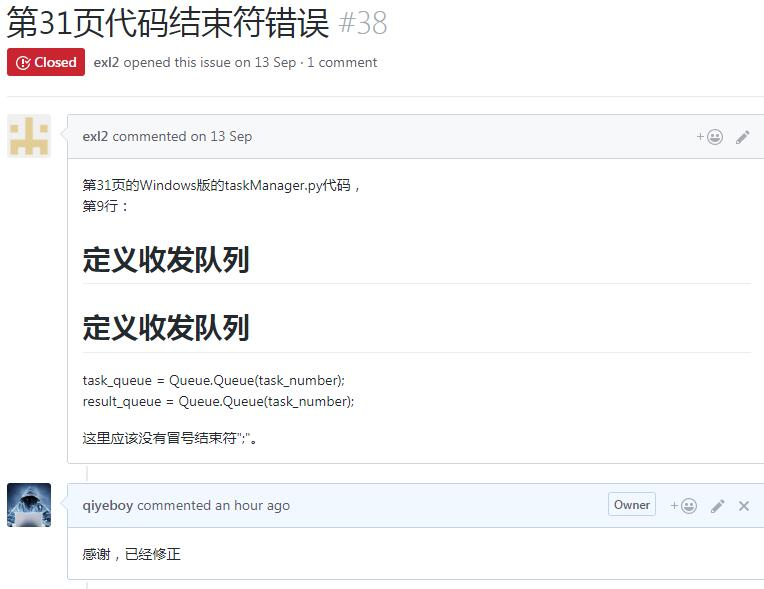
感谢 [@exl2](@exl2)
#### 28.第146页爬虫调度器引用错误
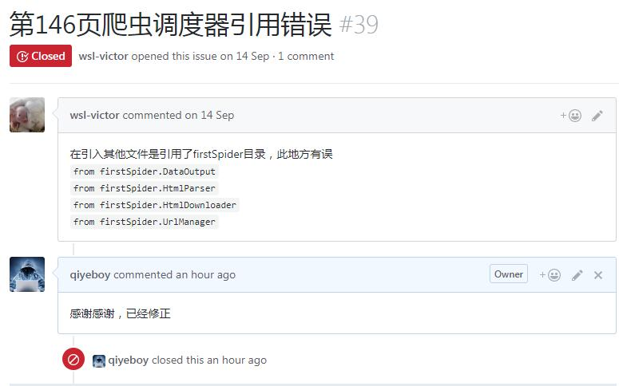
感谢 [@wsl-victor](@wsl-victor)
#### 29.第一章17页
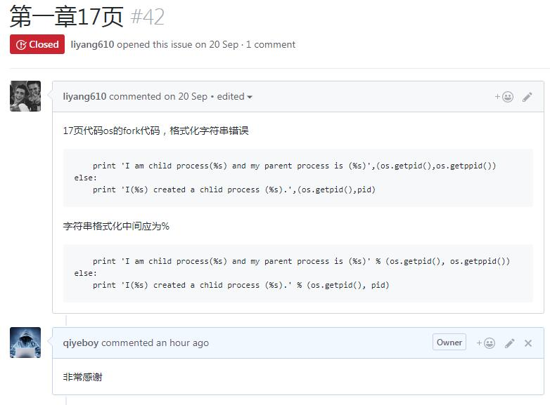
感谢 [@liyang610](@liyang610)
#### 30.第一章，第17页，关于join方法的建议
```python
join方法阻塞运行直至该进程结束，如果需要等待所有子进程结束，建议针对每个进程调用该方法。

原书代码：
def run_proc(name):

print 'Child process %s (%s) Running...' % (name, os.getpid())
if name == 'main':

print 'Parent process %s.' % os.getpid()

for i in range(5):

    p = Process(target=run_proc, args=(str(i),))

    print 'Process will start.'

    p.start()

p.join()

print 'Process end.'
建议将子进程规整入列表，以方便使用迭代处理每个进程，并“同步”每个进程，确保父进程在所有子进程结束后继续。修改如下：
def run_proc(name):

print 'Child process %s (%s) Running...' % (name, os.getpid())
if name == 'main':

print 'Parent process %s.' % os.getpid()
p=[]
for i in range(5):

    p.append(Process(target=run_proc, args=(str(i),)))

    print 'Process will start.'

    p[i].start()
利用进程列表，确保子进程全部结束后父进程再继续

 for process in p:
       process.join()

 print 'Process end.'


```